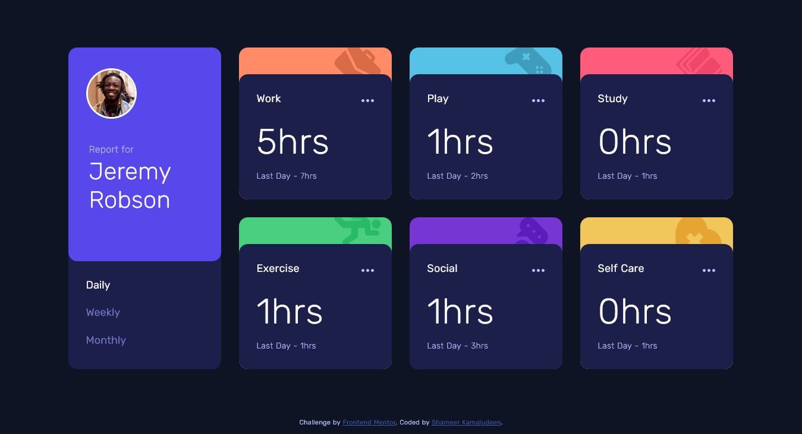

# Frontend Mentor - Time tracking dashboard solution

This is a solution to the [Time tracking dashboard challenge on Frontend Mentor](https://www.frontendmentor.io/challenges/time-tracking-dashboard-UIQ7167Jw). Frontend Mentor challenges help you improve your coding skills by building realistic projects. 

## Table of contents

- [Overview](#overview)
  - [The challenge](#the-challenge)
  - [Screenshot](#screenshot)
  - [Links](#links)
- [My process](#my-process)
  - [Built with](#built-with)
  - [Continued development](#continued-development)
  - [Useful resources](#useful-resources)
- [Author](#author)

## Overview

The challenge helped me learn to work with JSON, fetch API, async-await, grid, and flexbox. These are the things I used in the challenge, most of them are used in the previous challenge by the frontend mentor and got a chance to familiarize those. Because the design is a little tricky and includes a lot of elements the challenge was really helpful to learn to place the elements and a lot of layout practices.

### The challenge

Users should be able to:

- View the optimal layout for the site depending on their device's screen size
- See hover states for all interactive elements on the page
- Switch between viewing Daily, Weekly, and Monthly stats

### Screenshot

### Links

- Solution URL: [Click here](https://github.com/shameerkamaludeen/time-tracking-dashboard)
- Live Site URL: [Click here](https://shameerkamaludeen.github.io/time-tracking-dashboard/)

## My process

### Built with

- Semantic HTML5 markup
- Flexbox
- CSS Grid
- Mobile-first workflow
- Fetch API
- JSON

### Continued development

The main area that I want to focus on as the previous challenge from the frontend mentor is accessibility and another area I keep on struggling or not focusing on where I need more push is how to structure the document properly so we don't need to rearrange it while writing CSS which cause more re-writing codes as well as time.

### Useful resources

- [Working with JSON](https://developer.mozilla.org/en-US/docs/Learn/JavaScript/Objects/JSON)
- [Grids](https://developer.mozilla.org/en-US/docs/Learn/CSS/CSS_layout/Grids)
- [Flexbox](https://developer.mozilla.org/en-US/docs/Learn/CSS/CSS_layout/Flexbox)
- [How to use promises](https://developer.mozilla.org/en-US/docs/Learn/JavaScript/Asynchronous/Promises)

## Author

- Github - [Shameer Kamaludeen](https://github.com/shameerkamaludeen)
- Frontend Mentor - [@shameerkamaludeen](https://www.frontendmentor.io/profile/shameerkamaludeen)